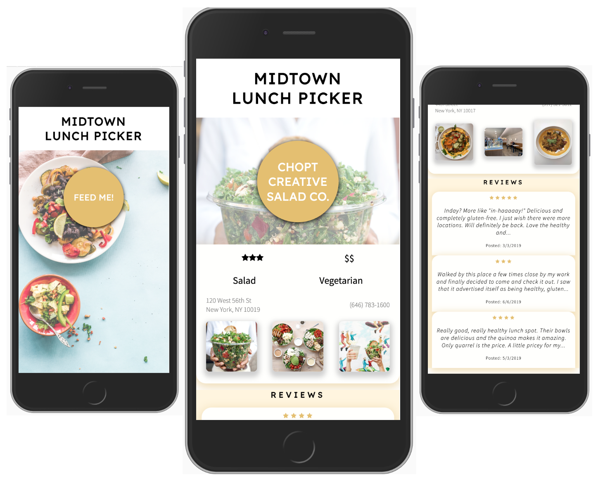

# Midtown Lunch Picker

Can't decide on where to grab lunch? Let MLP randomly pick for you!

New York offers a wide range of options on where to eat out, order delivery, or just pick up something to eat. Midtown Lunch Picker makes it easy and fun to select a spot by randomly picking from a curated list of restaurants in Midtown Manhattan. Take a look at the photos, cuisine type, and reviews, to help you decide - otherwise generate another random choice.

## Screenshots

    

    

## Getting Started

### Prerequesities
* Node.js
* Yelp API Key
* List of locations with Yelp ID's and Names

### Installation

1. Begin by forking this repository, and cloning to your computer. 

2. Prepare a `.env` file following the examples in the folders `client` and `server`. 

3. Install the necessary dependencies.
Run `npm i` in both the `client` and `server` folders.

4. In the client folder, create a `locations.json` file following the example provided as a guide. This is a dataset of restaurants and their yelp_id's that the app will used to randomly select a place. This  makes the app easy to customize. The yelp_id's can be obtained by using the Yelp API.

### To Start

To start the backend, navigate to the `server` folder and run `node index.js`. If the server has successfully started, a console log will appear in the terminal stating "Listening on port...".

To start the frontend, navigate to the `client` folder and run `npm start`. This will build the React app, and open it in the browser.

## Tech Stack

* React - frontend framework
* Redux - state management
* Koa - backend framework
* Yelp API - for location details
* Jest & Enzyme for Testing
* SCSS, react-spring for styling
